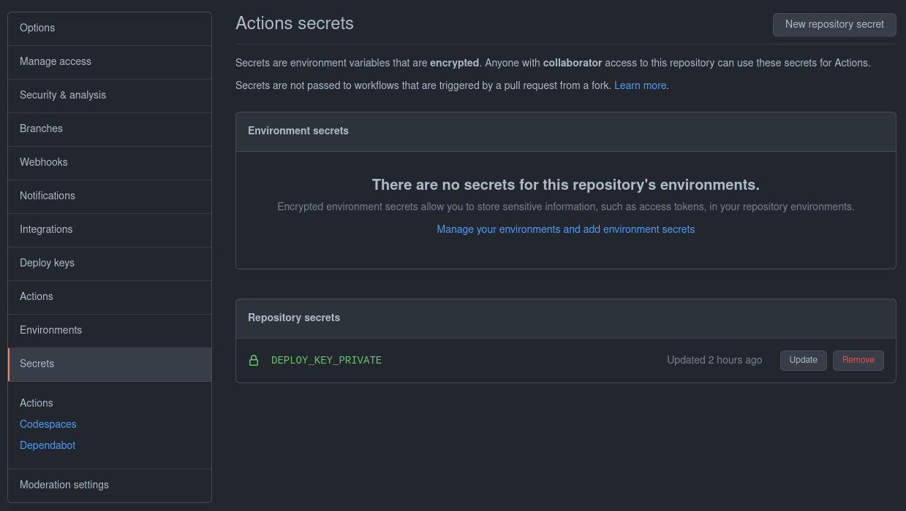
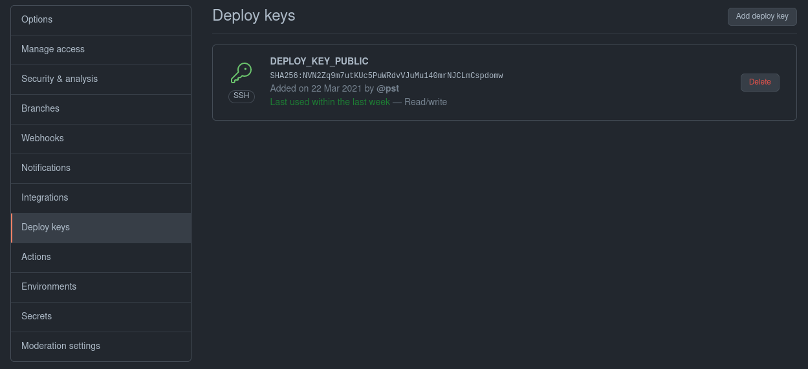

# Update Deployment Repo Action

When driving a GitOps workflow using GitHub Actions and Kustomize, it is a common requirement to update the images attribute in a Kustomization with the latest image tag built by the current CI run.

This action provides a convenient way to checkout a specific branch of a second repository, usually referred to as the deployment or config repository, run `kustomize edit set image ...` in the correct directory and finally commit and push the change.

## Usage

The action uses a read/write deploy key to pull and push the second repository.

1. Add the private key as a base64 encoded secret to the first repository

   ```bash
   cat action_id_rsa | base64
   ```

   

1. Add the public key as a read/write deploy key in the second repository.

   ```bash
   cat action_id_rsa.pub
   ```

   

1. Add the action to your workflow and configure it to use the correct repo, branch, path, images and deploy key.

   ```yaml
   steps:
     - name: "Update deployment repo"
   uses: pst/update-deployment-repo-action@master
   with:
     deployment_repo_url: git@github.com:pst/update-deployment-repo-action.git
     deployment_repo_branch: test-target
     kustomization_path: test-kustomization
     kustomization_images: nginx:${{ github.sha }}
     deploy_key: ${{ secrets.DEPLOY_KEY_PRIVATE }}
   ```

## Inputs

- `deployment_repo_url` (required):

  Repository to commit to.

  ```yaml
  with:
    deployment_repo_url: git@github.com:owner/repository.git
  ```

- `deployment_repo_branch` (required):

  Branch in the repository to commit to.

  ```yaml
  with:
    deployment_repo_branch: branch-name
  ```

- `kustomization_path` (required):

  Path to the Kustomization inside the repo.

  ```yaml
  with:
    kustomization_path: path/to/kustomization
  ```

- `kustomization_images` (required):

  Args to pass to `kustomize edit set image`. Same format as the `kustomize` CLI.

  - `<image>=<newimage>:<newtag>`
  - `<image>=<newimage>@<digest>`
  - `<image>=<newimage>`
  - `<image>:<newtag>`
  - `<image>@<digest>`

  ```yaml
  with:
    kustomization_images: image:${{ github.sha }}
  ```

- `deploy_key` (required):

  Base64 encoded private key of a read/write deploy-key.

  ```yaml
  with:
    # store the base64 encode private key as a secret
    # e.g.: `cat action_id_rsa | base64`
    deploy_key: ${{ secrets.DEPLOY_KEY_PRIVATE }}
  ```

- `git_user_name` (optional):

  Git `user.name` to use for the commit. Defaults to `GitHub Actions`.

- `git_user_email` (optional):

  Git `user.email` to use for the commit. Defaults to `actions@users.noreply.github.com`.
